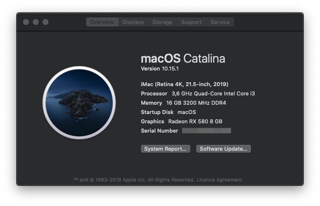
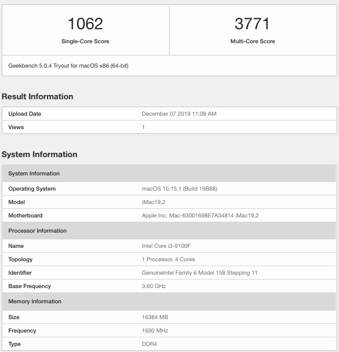

HACKINTOSH FOR GIGABYTE Z390 D
==

`Tested on Catalina 10.15.1`

## hardware

|         |                             |
| ------- | --------------------------- |
| **MB**  | GIGABYTE Z390 D             |
| **CPU** | Core i3 9100f               |
| **GPU** | Sapphire RX580 Nitro+ 8GB   |
| **SSD** | Samsung SSD 860 EVO 250GB   |
| **RAM** | Corasair CMK16GX4M2B3200C16 |

## What works

**All** including USB3 and sleep with power nap

**SPDIF** (optical and coaxial) works too with ext card:

## Geekbench

