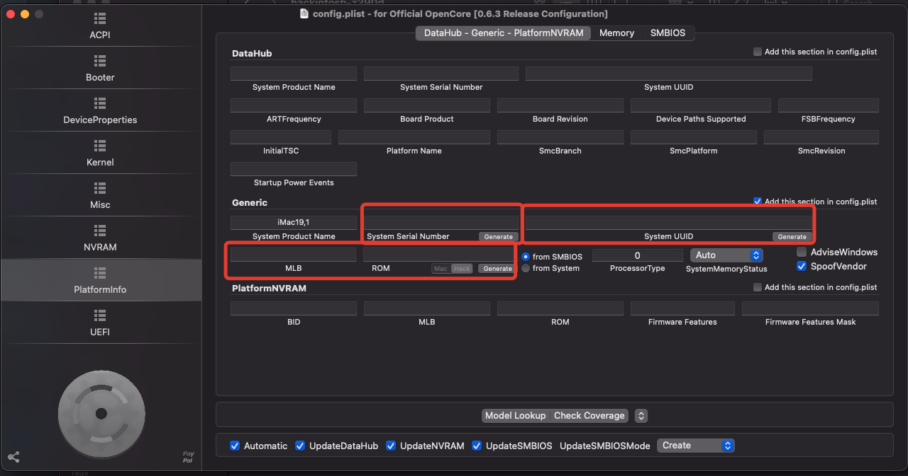
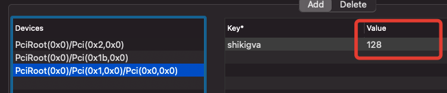

HACKINTOSH EFI FOR **GIGABYTE Z390 D**
==

> EFI OpenCore **0.63**

Hardware
--

|         |                             |
| ------- | --------------------------- |
| **MB**  | GIGABYTE Z390 D             |
| **CPU** | Core i3 9100f               |
| **GPU** | Sapphire RX580 Nitro+ 8GB   |
| **SSD** | NVME Samsung 970 EVO 500GB  |
| **RAM** | Corasair CMK16GX4M2B3200C16 |

How to
--

1. You have to update BIOS to ver **F3g**, because only it has the option **CFG Lock - Disable**, or you must use **AppleXcpmCfgLock** Quirk
2. Set up your BIOS according to the manual <https://dortania.github.io/OpenCore-Install-Guide/config.plist/coffee-lake.html#intel-bios-settings>
3. Generate and fill the blanks about the Mac (SN, UUID etc)

> ! This config is for **Core i3 9100f** CPU without graphic. If your CPU have built in graphic and you want to use it, please provide your own platform config

System info
--

What works
--

*Everything* including USB3 and sleep with power nap

*SPDIF* (optical and coaxial) works too with ext card:

Geekbench
--

